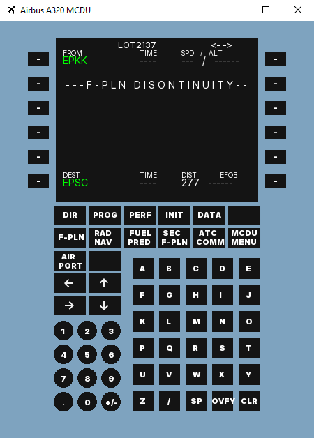

# A320-MCDU
### Projekt używający C++ i biblioteki SFML do stworzenia programu okienkowego symulującego działanie komputera pokładowego Airbusa A320.
### Przykładowy wygląd programu

### Cel projektu
Celem projektu jest stworzenie w pełni funkcjonalnego komputera pokładowego MCDU 
(Multipurpose Control and Disply Unit) obsługującego bazę danych stworzoną na
podstawie danych udostępnianych przez PANSA (Polską Agencję Żeglugi Powietrznej).
