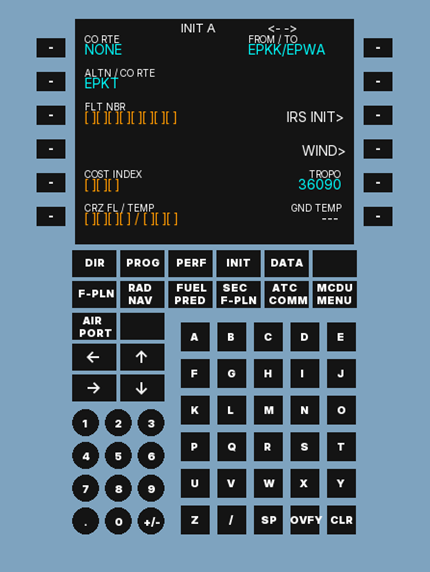

# KOMPUTER POKŁADOWY SAMOLOTU AIRBUS A320 - MCDU
### Projekt w języku C++ z użyciem biblioteki SFML, tworzący program okienkowy symulujący działanie MCDU - Multipurpose Control and Disply Unit

### Przykładowy wygląd programu


### Cel projektu
Celem projektu jest stworzenie symulowanego komputera pokładowego MCDU 
(Multipurpose Control and Disply Unit) obsługującego jedynie podstawowe zadania 
oraz prostą bazę danych stworzoną na podstawie danych udostępnianych przez PANSA 
(Polską Agencję Żeglugi Powietrznej).

### Wzornictwo
Projekt inspirowany interfejsem MCDU samolotu Airbus A320-200.  
Układ graficzny został samodzielnie odwzorowany na podstawie ogólnodostępnych źródeł.

### Działanie 
Projekt wykorzystuje:
- bibliotekę **SFML** do obsługi grafiki i zdarzeń,
- **SQLite** jako lokalną bazę danych.

Z bazy danych pobierane są informacje o lotniskach, które użytkownik może wybrać w ramach interakcji z programem.

### Instrukcja
Sczegółowa instrukcja użytkowania znajduje się w pliku [instrukcja.pdf](instrukcja.pdf)

### Podgląd 


### Uruchamianie
#### Instalacja wymaganych pakietów
```
sudo apt update
sudo apt install build-essential cmake git \
    libx11-dev libxrandr-dev libfreetype6-dev \
    libgl1-mesa-dev libudev-dev libopenal-dev \
    libvorbis-dev libflac-dev
```

#### Pobranie projektu z GitHub
```
git clone https://github.com/Sekula-Jakub/A320-MCDU.git
cd A320-MCDU
```

#### Budowanie projektu
```
mkdir MCDU_build
cd MCDU_build
```
#### Skonfigurowanie projektu
```
cmake ..
```

#### Zbudowanie projektu
```
cmake --build .
```

#### Uruchomienie programu z głównego katalogu
```
cd ..
./MCDU_build/MCDU
```

### Źródła danych do bazy danych
Dane (kody lotnisk, współrzędne geograficzne) pochodzą z AIP IFR PANSA

#### https://www.ais.pansa.pl/publikacje/aip-polska/

Dane zostały wykorzystane wyłącznie do celów edukacyjnych.