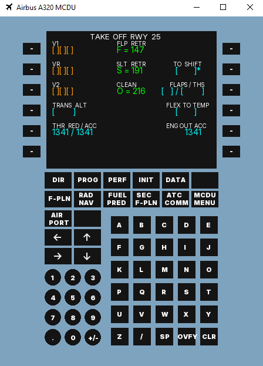
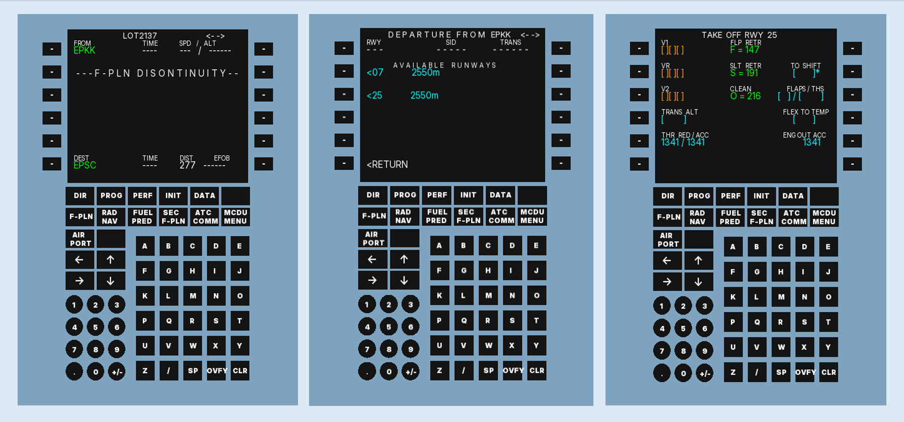

# A320-MCDU
### Projekt używający C++ i biblioteki SFML do stworzenia programu okienkowego symulującego działanie komputera pokładowego Airbusa A320.
### Przykładowy wygląd programu

### Cel projektu
Celem projektu jest stworzenie funkcjonalnego komputera pokładowego MCDU 
(Multipurpose Control and Disply Unit) obsługującego jedynie podstawowe zadania 
oraz bazę danych stworzoną na podstawie danych udostępnianych przez PANSA 
(Polską Agencję Żeglugi Powietrznej).

### Wzornictwo
Ze względu na brak dostępności oryginału urządzenia a tym samym dokładnego 
odwzorowania funkcji, projekt wzorowany jest na pracy firmy FenixSim Limited,
która wytwarza oprogramowanie do symulacji lotniczych m.in. modele samolotów
Airbus A319, A320, A321. 
#### https://fenixsim.com

### Działanie 
Projekt działa w oparciu o bibliotekę SFML oraz bazę danych stworzoną przy 
pomocy SQLite. Z bazy pobierane są informacje na temat lotnisk wybieranych
podczas wypełniania odpowiednich stron.

### Podgląd 
