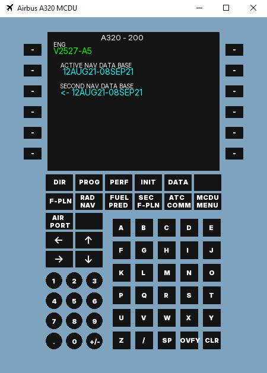

# A320-MCDU
### Projekt używający C++ i biblioteki SFML do stworzenia programu okienkowego symulującego działanie komputera pokładowego Airbusa A320.
### Przykładowy wygląd programu

### Cel projektu
Celem projektu jest stworzenie w pełni funkcjonalnego komputera pokładowego MCDU 
(Multipurpose Control and Disply Unit) obsługującego podstawowe zadania oraz bazę 
danych stworzoną na podstawie danych udostępnianych przez PANSA (Polską Agencję 
Żeglugi Powietrznej).

### Wzornictwo
Ze względu na brak dostępności oryginału urządzenia a tym samym dokładnego 
odwzorowania funkcji, projekt wzorowany jest na pracy firmy FenixSim Limited,
która wytwarza oprogramowanie do symulacji lotniczych m.in. modele samolotów
Airbus A319, A320, A321. 
#### https://fenixsim.com